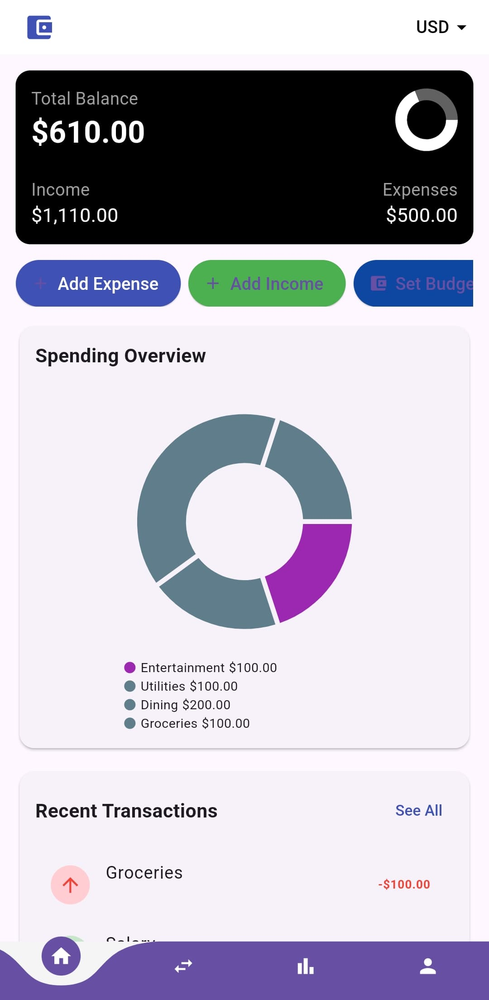
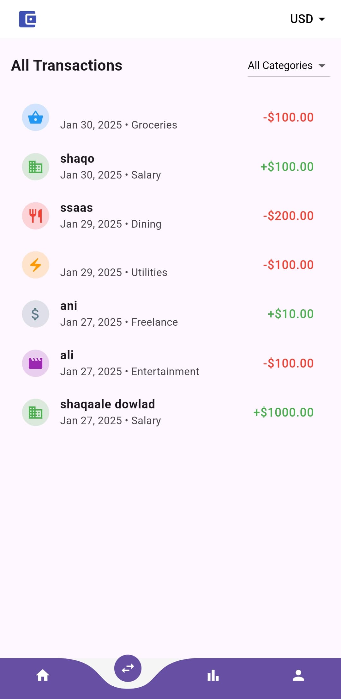
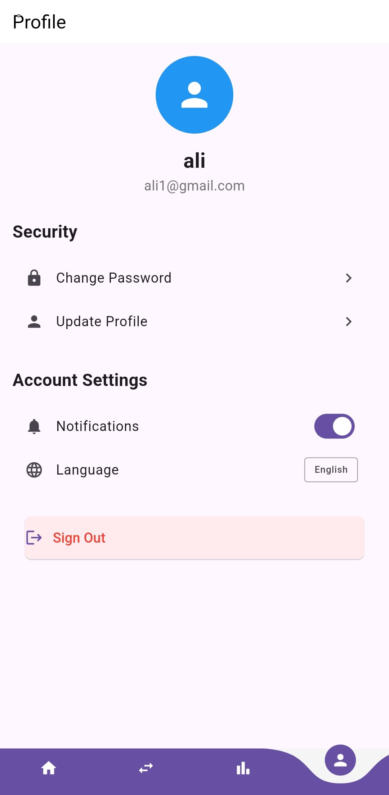

# Personal Budget App

[](https://flutter.dev/)
[](https://opensource.org/licenses/MIT)

A comprehensive Flutter application designed for efficient personal finance management, enabling users to take control of their financial health through intuitive budget tracking and analysis.

<div align="center">

### 📱 App Screenshots

<table>
  <tr>
    <td><b>Dashboard Overview</b></td>
    <td><b>Transaction History</b></td>
  </tr>
  <tr>
    <td>
      
      <p>Track your total balance, income, and expenses with an intuitive pie chart for spending analysis</p>
    </td>
    <td>
      
      <p>View detailed transaction history with categorization and filtering options</p>
    </td>
  </tr>
  <tr>
    <td><b>Profile & Settings</b></td>
    <td><b>Welcome Screen</b></td>
  </tr>
  <tr>
    <td>
      
      <p>Manage your profile, security settings, and preferences</p>
    </td>
    <td>
      
      <p>Easy onboarding process with feature highlights</p>
    </td>
  </tr>
</table>

</div>

## 📋 Table of Contents
- [Overview](#overview)
- [Features](#features)
- [System Requirements](#system-requirements)
- [Technology Stack](#technology-stack)
- [Getting Started](#getting-started)
- [Development Setup](#development-setup)
- [Architecture](#architecture)
- [Testing](#testing)
- [Troubleshooting](#troubleshooting)
- [Contributing](#contributing)
- [Support](#support)
- [License](#license)

## 🎯 Overview

Personal Budget App is a modern, cross-platform financial management solution built with Flutter. It provides users with powerful tools to track income, manage expenses, and analyze spending patterns, helping them make informed financial decisions.

## ✨ Features

### Core Functionality
- **Transaction Management**
  - Add, edit, and delete income entries
  - Track expenses with customizable categories
  - Bulk transaction operations
  - Transaction history with advanced filtering

### Financial Analysis
- **Budget Tracking**
  - Monthly budget planning
  - Category-wise budget allocation
  - Real-time budget vs. actual comparison
  - Spending pattern analysis

### User Experience
- **Authentication & Security**
  - Secure user authentication
  - Data encryption
  - Privacy-focused design

### Technical Features
- **Cross-Platform Support**
  - Responsive design for mobile and web platforms
  - Consistent experience across devices
  - Offline functionality
- **Data Management**
  - Cloud synchronization
  - Local data persistence
  - Data export capabilities

## 💻 System Requirements

### Development Environment
- **Flutter SDK:** 3.0 or higher
- **Dart SDK:** 2.17 or higher
- **IDE:** VS Code, Android Studio, or IntelliJ IDEA
- **Git:** 2.x or higher

### Supported Platforms
- **iOS:** 11.0 or higher
- **Android:** API level 21 (Android 5.0) or higher
- **Web:** Modern browsers (Chrome, Firefox, Safari, Edge)

## 🛠 Technology Stack

- **Frontend:** Flutter, Dart
- **State Management:** Provider
- **Backend:** Firebase
- **Database:** Cloud Firestore
- **Authentication:** Firebase Auth

## 🚀 Getting Started

### Prerequisites
1. Install Flutter SDK
2. Set up your preferred IDE
3. Install Git
4. Configure Firebase project (for backend services)

### Installation

1. Clone the repository:
   ```bash
   git clone https://github.com/alidiamond1/Personal_Budget_App.git
   ```

2. Navigate to the project directory:
   ```bash
   cd personal_budget_app
   ```

3. Install dependencies:
   ```bash
   flutter pub get
   ```

### Running the Application

```bash
# Development
flutter run

# Release mode
flutter run --release
```

## 🏗 Development Setup

### Code Style
- Follow the official [Flutter style guide](https://flutter.dev/docs/development/style-guide)
- Use consistent naming conventions
- Maintain proper documentation

### Environment Setup
1. Configure Firebase:
   - Create a Firebase project
   - Download configuration files
   - Set up authentication methods

2. IDE Configuration:
   - Install Flutter and Dart plugins
   - Configure code formatting
   - Set up recommended extensions

## 🎨 Architecture

The application follows a clean architecture pattern with the following layers:
- **Presentation Layer:** UI components and screens
- **Business Logic Layer:** State management and business rules
- **Data Layer:** Repository pattern for data management
- **Domain Layer:** Core business entities and interfaces

## 🧪 Testing

### Running Tests
```bash
# Unit tests
flutter test

# Integration tests
flutter test integration_test

# Widget tests
flutter test --tags=widgets
```

### Test Coverage
```bash
flutter test --coverage
genhtml coverage/lcov.info -o coverage/html
```

## 🔧 Troubleshooting

### Common Issues
1. **Build Failures**
   - Clean build files: `flutter clean`
   - Update dependencies: `flutter pub upgrade`

2. **Firebase Connection Issues**
   - Verify configuration files
   - Check internet connectivity
   - Validate Firebase console settings

## 👥 Contributing

We welcome contributions! Please follow these steps:

1. Fork the repository
2. Create a feature branch:
   ```bash
   git checkout -b feature/your-feature-name
   ```
3. Commit your changes:
   ```bash
   git commit -m "feat: add some feature"
   ```
4. Push to your branch:
   ```bash
   git push origin feature/your-feature-name
   ```
5. Open a pull request

### Contribution Guidelines
- Follow the coding style guide
- Write meaningful commit messages
- Add tests for new features
- Update documentation as needed

## 🆘 Support

- **Documentation:** See the [Wiki](https://github.com/alidiamond1/Personal_Budget_App/wiki) section
- **Issues:** Please report bugs via [GitHub Issues](https://github.com/alidiamond1/Personal_Budget_App/issues)
- **Questions:** Open a [Discussion](https://github.com/alidiamond1/Personal_Budget_App/discussions)

## 📄 License

This project is licensed under the MIT License - see the [LICENSE](LICENSE) file for details.

---

For detailed Flutter development guidance, visit the [Flutter Documentation](https://docs.flutter.dev/).

